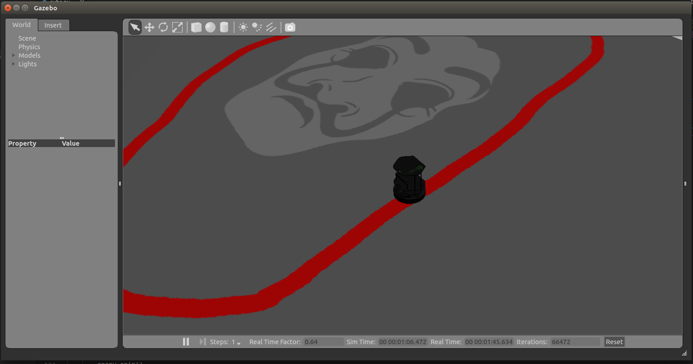

# Project Title
Line Following Turtlebot using OpenCV

## Motivation
This project is an Assignment for Autonomous System (ENGR7712) topic at Flinders University


## Screenshot



## Getting Started
The project is developed using ROS and OpenCV under Ubuntu environment. The subs.py will run control node to navigate Turtlebot through line.

### Prequisites
- Python 
- ROS
- OpenCV
- CMake

```
pip install opencv-python
```

## Instruction

- Create ROS Package to store the program

```
catkin_create_pkg [package_name] rospy
```
- Cmake the package
```
cd ~/catkin_ws
catkin make
source ~/catkin_ws/devel/setup.bash
```
Clone or download the repository
```
cd [package_name]
git clone https://github.com/bambangbot/turtlebot_opencv.git 
```
- Run ROScore
```
roscore
```
- Run Turtlebot Simulation
```
roslaunch turtlebot_gazebo turtlebot_world.launch world_file:=/home/[user]/catkin_ws/src/subs_camera/src turtlebot_custom_gazebo_worlds/line_map.world
``` 
- Run OpenCV node
```
rosrun [package-name] subs.py
```
## Technical Discussion

This project use two ROS topics. First subscribe from "/camera/rgb/image_raw" to capture image and process it using OpenCV lib and publish velocity of Turtlebot to '/cmd_vel_mux/input/teleop' based on camera reading.

There are three main function in the program.
- Callback funtion to retain image from Turtlebot Camera. 
- Convert Image function to translate image from ROS format to OpenCV
- Process Image function to process the captured frame. 

The image processing focused on edge detection based on color of detection. From the edge detection the shape of of line is developed and using Moments function the center of the shape is determined.
Turtlebot navigation is based on center point of line shape.


## Author

* **Rezka Bunaiya Prayudha**

